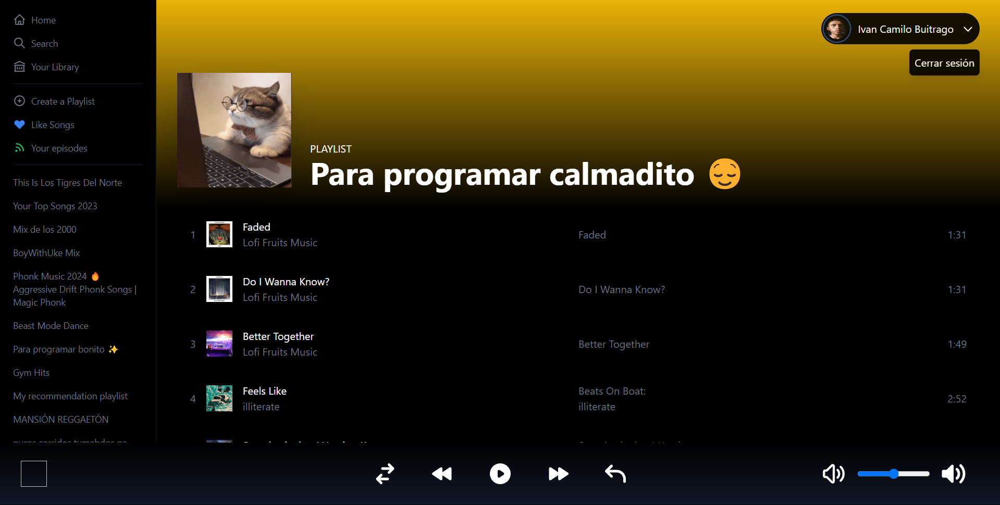

# Cool Clon Spotify With NextJS

Proyecto realizado con el fin de poner en practica el consume de APIs, ademas de poner en practima temas de diseño web

## Tools:
- NextJS
- React
- Debounce
- Tailwind CSS
- Spotify API
- 0auth JWT
- access/refresh
- tokens
- NextAuth
- Recoil

Si quieres revizar el proyecto desde tu equipo debes clonar el repositorio, instalar dependencias, ir a la consola para desarrolladores de [Spotify](https://developer.spotify.com/dashboard) y generar el secret id para que te funcione en local.

----

